# Build Decision Matrix
{: .fs-9 }

Decision trees and scenario matrices for ViteKit.Msbuild build execution.
{: .fs-6 .fw-300 }

## Primary Decision Tree

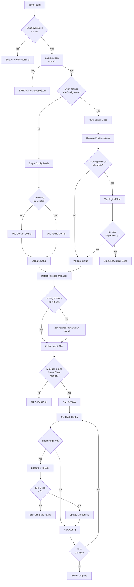

## Incremental Build Decision Matrix

| Condition | Input Files Changed | Config Changed | Dependency Rebuilt | Output Manually Modified | Decision |
|-----------|---------------------|----------------|-------------------|-------------------------|----------|
| First Build (no marker) | N/A | N/A | N/A | N/A | **BUILD** |
| All unchanged | ❌ No | ❌ No | ❌ No | ❌ No | **SKIP** |
| Source file modified | ✅ Yes | ❌ No | ❌ No | ❌ No | **BUILD** |
| Config modified | ❌ No | ✅ Yes | ❌ No | ❌ No | **BUILD** |
| Dependency rebuilt | ❌ No | ❌ No | ✅ Yes | ❌ No | **BUILD** (cascade) |
| Output modified | ❌ No | ❌ No | ❌ No | ✅ Yes | **BUILD** (detected) |
| Multiple changes | ✅ Yes | ✅ Yes | ❌ No | ❌ No | **BUILD** |
| After `dotnet clean` | ❌ No | ❌ No | ❌ No | ❌ No | **BUILD** (no marker) |

## Command Type Decision Tree

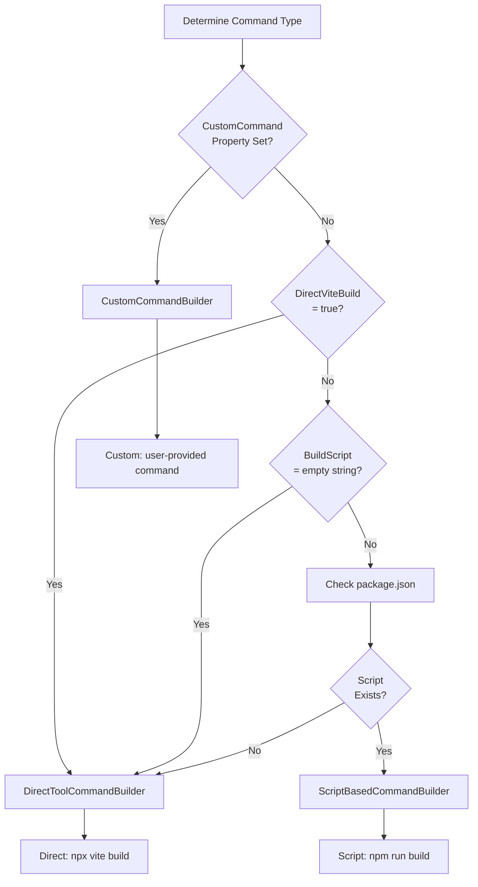

**Command Type Examples:**

| Configuration | Package.json Scripts | Result | Command |
|---------------|---------------------|--------|---------|
| Default | `"build": "vite build"` | Script-based | `npm run build` |
| `<DirectViteBuild>true</DirectViteBuild>` | Any | Direct tool | `npx vite build` |
| `<BuildScript></BuildScript>` | Any | Direct tool | `npx vite build` |
| `<CustomCommand>vite build --ssr</CustomCommand>` | Any | Custom | `vite build --ssr` |
| Default | No scripts | Direct tool | `npx vite build` |

## Mode Resolution Decision Tree

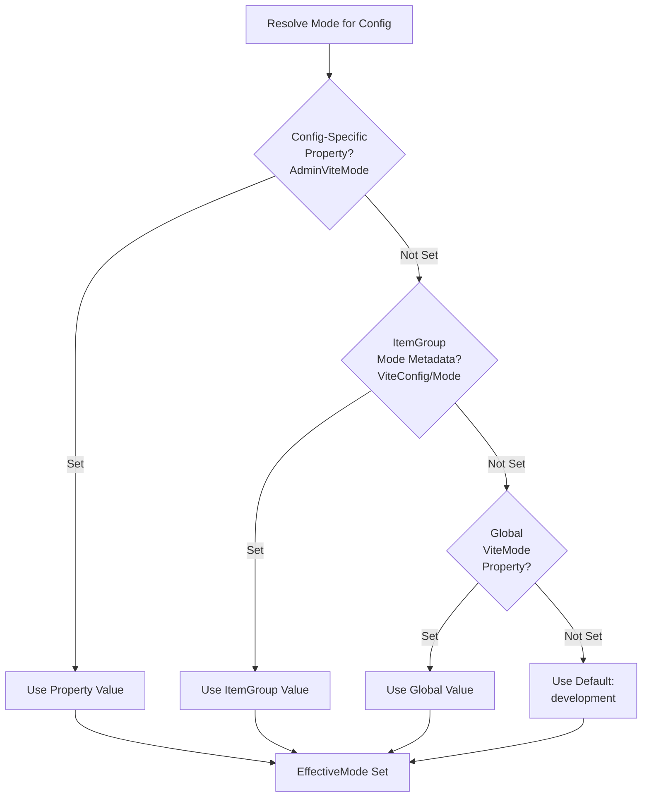

**Mode Resolution Examples:**

| Global ViteMode | ItemGroup Mode | Config Property | Result | Priority |
|-----------------|----------------|-----------------|--------|----------|
| production | - | - | production | 3 (global) |
| production | staging | - | staging | 2 (ItemGroup) |
| production | staging | qa | qa | 1 (property - highest) |
| production | - | development | development | 1 (property) |
| - | - | - | development | 4 (default) |
| production | - | - | production | 3 (global) |

## Package Manager Detection Decision Tree

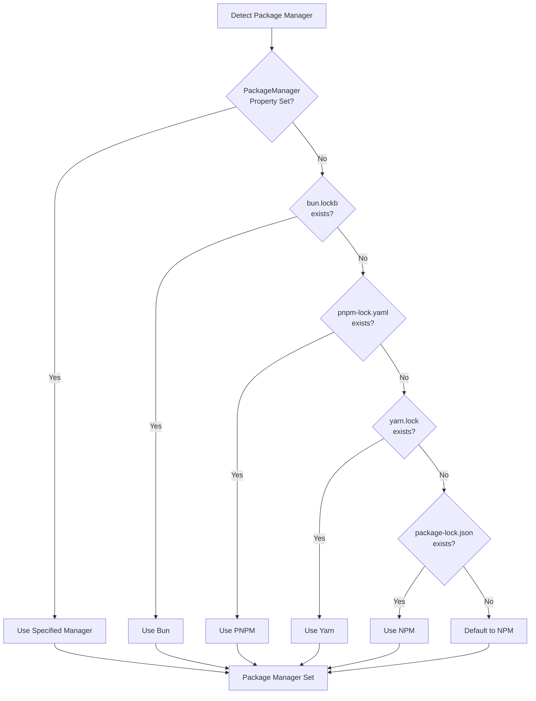

## Common Build Scenarios

### Scenario 1: First Build (Clean State)

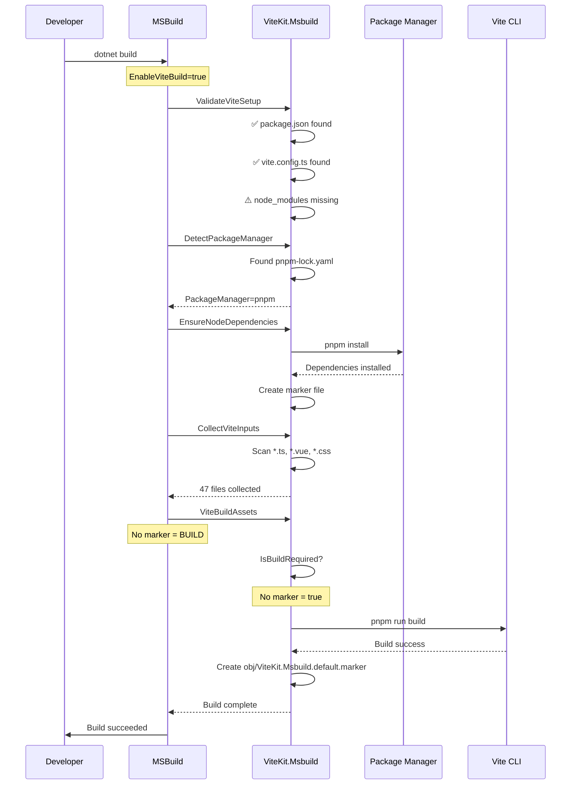

**Key Points:**
- No markers exist (first build)
- npm install runs (no node_modules)
- All files collected
- Build always executes
- Markers created for next build

**Duration:** ~30-60s (includes npm install)

---

### Scenario 2: No Changes (Incremental Skip)

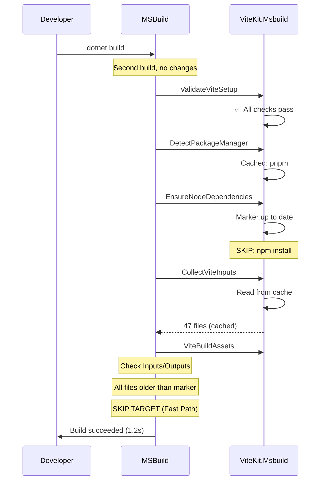

**Key Points:**
- MSBuild Inputs/Outputs triggers fast skip
- C# task never executes
- No file scanning, no Vite execution
- Extremely fast (~1s)

**Duration:** ~1-2s

---

### Scenario 3: Single File Change

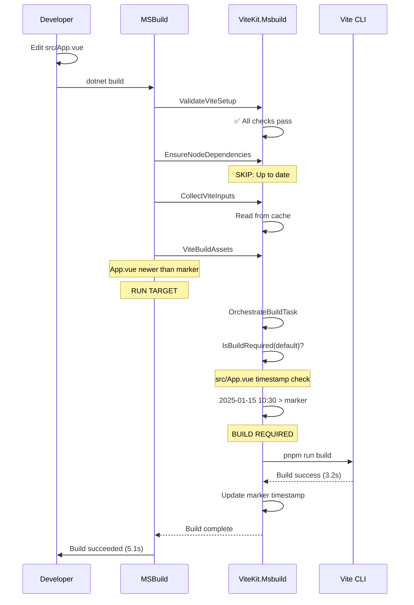

**Key Points:**
- MSBuild detects file change via Inputs/Outputs
- C# task confirms via IsBuildRequired()
- Only changed config rebuilds
- Marker updated with new timestamp

**Duration:** ~3-5s (Vite build time)

---

### Scenario 4: Multi-Config with Dependencies

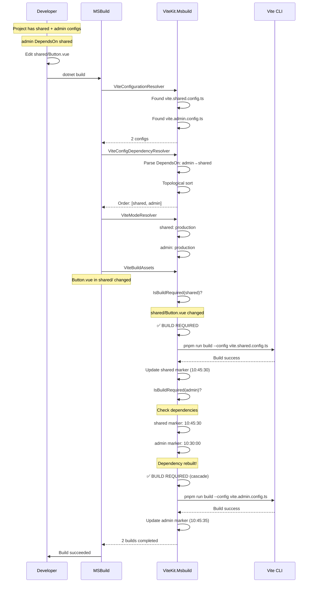

**Key Points:**
- Dependency resolution orders builds
- shared builds first (source changed)
- admin builds second (dependency cascade)
- Both markers updated
- Next build with no changes: both skip

**Duration:** ~6-12s (2× Vite build time)

---

### Scenario 5: Config File Change

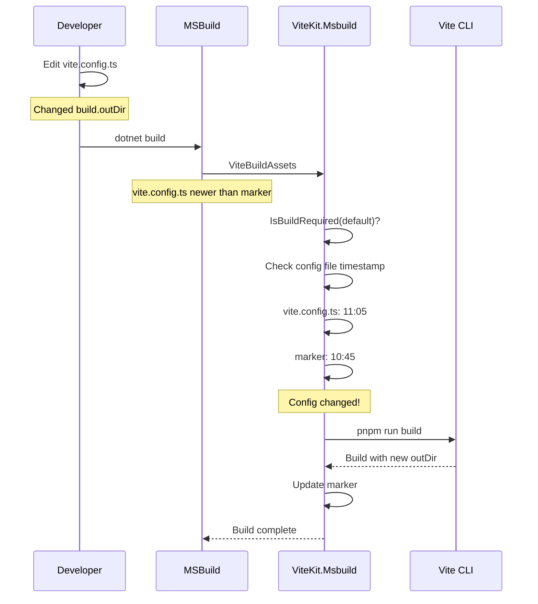

**Key Points:**
- Config changes always trigger rebuild
- Affects all configs using that file
- New output directory used
- Critical for config experimentation

**Duration:** ~3-5s

---

### Scenario 6: Parallel Build (Multiple Projects)

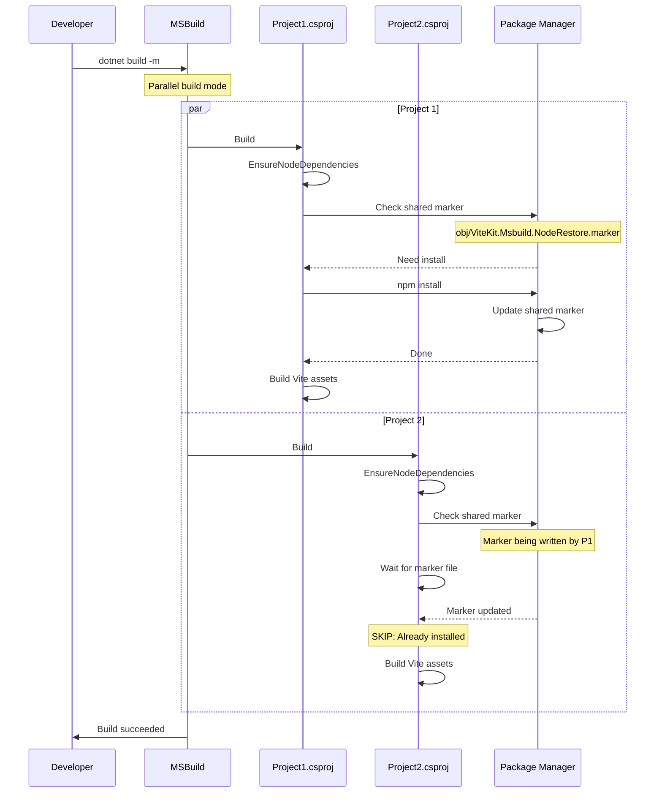

**Key Points:**
- Shared marker file prevents duplicate installs
- First project installs, others skip
- Parallel-build safe via marker file locking
- Significant time savings in CI/CD

**Duration:** ~30s (single install, parallel builds)

---

### Scenario 7: dotnet clean → dotnet build

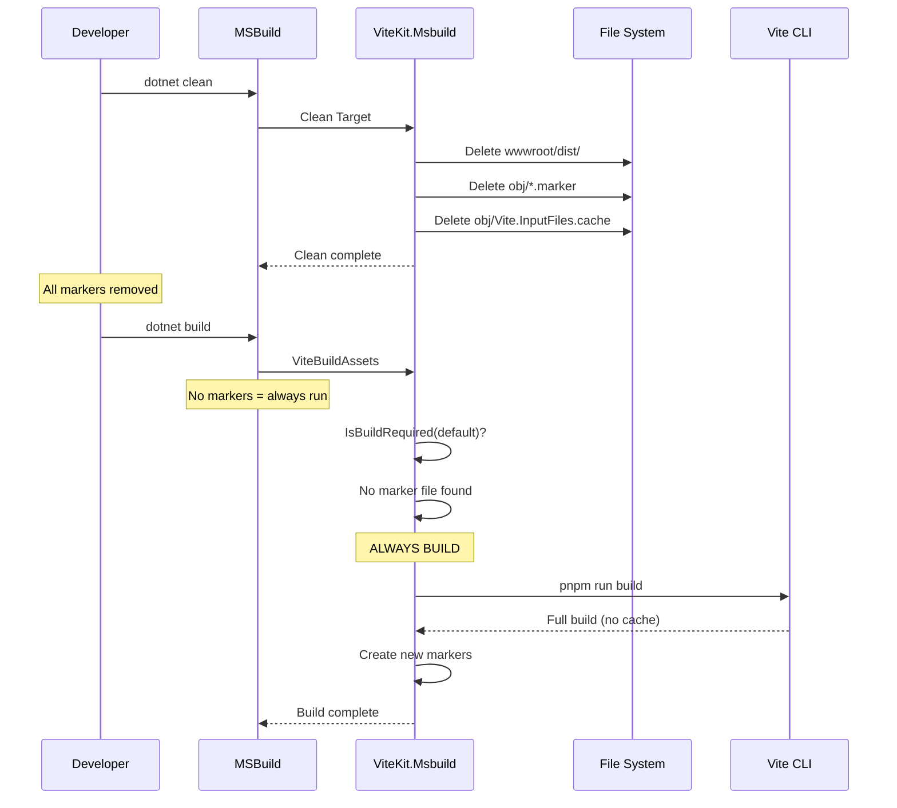

**Key Points:**
- Clean removes all markers and outputs
- Next build is always full rebuild
- No incremental checks (no markers to compare)
- Ensures clean state for troubleshooting

**Duration:** ~30-60s (full rebuild)

---

### Scenario 8: CI/CD Build (First Time)

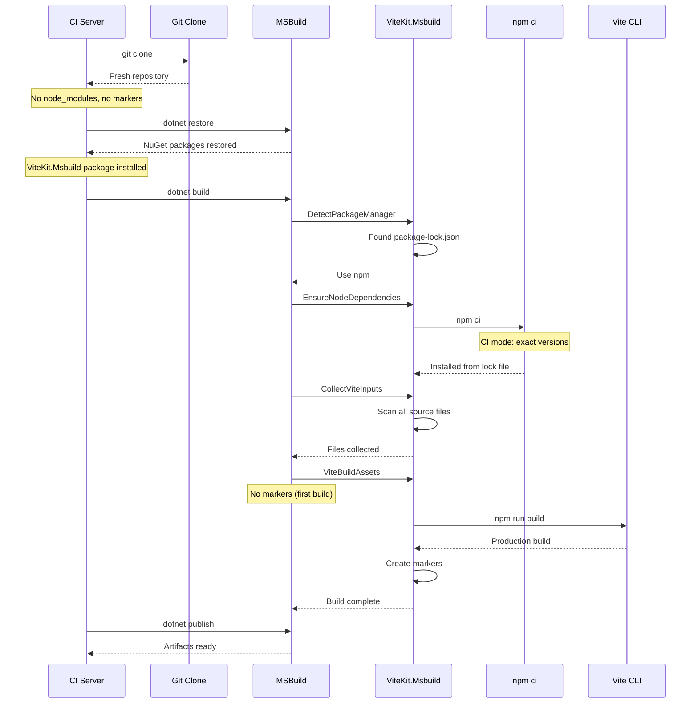

**Key Points:**
- Always full build (no markers in repo)
- Uses `npm ci` for reproducible builds
- Lock file ensures version consistency
- Markers not committed to git
- Build artifacts ready for deployment

**Duration:** ~60-120s (includes npm ci)

---

## Decision Matrix: When Does Each Config Build?

| Scenario | Config A (Standalone) | Config B (DependsOn: A) | Config C (DependsOn: B) |
|----------|----------------------|-------------------------|-------------------------|
| First build | ✅ BUILD | ✅ BUILD | ✅ BUILD |
| A source changed | ✅ BUILD | ✅ BUILD (cascade) | ✅ BUILD (cascade) |
| B source changed | ⏭️ SKIP | ✅ BUILD | ✅ BUILD (cascade) |
| C source changed | ⏭️ SKIP | ⏭️ SKIP | ✅ BUILD |
| A config changed | ✅ BUILD | ⏭️ SKIP | ⏭️ SKIP |
| After clean | ✅ BUILD | ✅ BUILD | ✅ BUILD |
| No changes | ⏭️ SKIP | ⏭️ SKIP | ⏭️ SKIP |

## Build Timing Decision Matrix

| ViteBuildTiming | Target Hook | Runs Before | Use Case |
|-----------------|-------------|-------------|----------|
| `BeforeCSharp` (default) | `BeforeTargets="ResolveStaticWebAssetsInputs"` | C# compilation | Standard web apps |
| `AfterCSharp` | `AfterTargets="Build"` | After C# build completes | Codegen scenarios |
| Not set | Same as `BeforeCSharp` | C# compilation | Default behavior |

## Error Scenarios

### Circular Dependency Detected

```
[ERROR] Circular dependency detected in Vite configurations:
  admin → shared → ui → admin

To fix this issue:
  1. Remove one of the dependencies to break the cycle
  2. Restructure your build dependencies
  3. Example: Remove DependsOn from 'ui' config

Current dependency chain: admin → shared → ui → admin
                                              └─────┘
                                              Cycle here
```

### Missing Dependency

```
[ERROR] Configuration 'admin' depends on 'shared', but 'shared' configuration not found

Available configurations:
  - admin
  - customer

To fix this issue:
  1. Add ViteConfig for 'shared'
  2. Or remove DependsOn from 'admin'
```

### Duplicate BuildId

```
[ERROR] Duplicate BuildId 'admin' found in multiple configurations:
  - vite.admin.config.ts (BuildId: admin)
  - Areas/Admin/vite.config.ts (BuildId: admin)

To fix this issue:
  1. Explicitly set unique BuildIds for each config
  2. Example:
     <ViteConfig Include="vite.admin.config.ts">
       <BuildId>admin-spa</BuildId>
     </ViteConfig>
```

## Performance Decision Matrix

| Build Type | MSBuild Check | C# Task Check | npm Install | Vite Build | Total Time |
|------------|---------------|---------------|-------------|------------|------------|
| First build | Skip | Skip | ✅ Run | ✅ Run | ~30-60s |
| No changes | ✅ Skip | N/A | Skip | Skip | ~1-2s |
| Source changed | Run | ✅ Skip others | Skip | ✅ Run changed | ~3-5s |
| Config changed | Run | ✅ Rebuild all | Skip | ✅ Run all | ~N×3-5s |
| After clean | Run | ✅ Run all | Skip | ✅ Run all | ~N×3-5s |
| Lock file changed | Run | Run | ✅ Run | ✅ Run | ~30-60s |

**Legend:**
- ✅ = Action taken
- ⏭️ = Skipped (optimization)
- N/A = Not reached (fast path)
- N = Number of configs

## Build Input Calculation Decision Tree

```mermaid
graph TB
    Start[Calculate Build Inputs] --> Step1{ViteInputFiles<br/>Already Populated?}
    
    Step1 -->|Yes| UseExisting[Use Existing Items]
    Step1 -->|No| CheckCache{Input Cache<br/>Exists?}
    
    CheckCache -->|Yes| ValidCache{Cache Valid?<br/>package.json/config<br/>unchanged?}
    ValidCache -->|Yes| ReadCache[Read from Cache]
    ValidCache -->|No| Scan
    
    CheckCache -->|No| Scan[Scan Project Root]
    
    Scan --> AdvTask{ViteUseAdvancedTasks<br/>= true?}
    
    AdvTask -->|Yes| CSTask[CollectViteInputFilesTask]
    AdvTask -->|No| MSBGlob[MSBuild Glob Patterns]
    
    CSTask --> IncludePatterns
    MSBGlob --> FallbackPatterns
    
    subgraph "C# Task Scanning (Advanced)"
        IncludePatterns[Include Patterns:<br/>**/*.ts, *.tsx, *.mts<br/>**/*.js, *.jsx, *.mjs<br/>**/*.vue, *.svelte<br/>**/*.css, *.scss, *.sass<br/>**/*.less, *.styl]
        
        IncludePatterns --> ExcludePatterns[Exclude Patterns:<br/>node_modules/**<br/>.git/**<br/>obj/**, bin/**<br/>dist/**<br/>{ViteOutputDir}/**]
        
        ExcludePatterns --> FilterExt[Filter by Extension:<br/>Check IsValidSourceFile()]
        
        FilterExt --> AddConfig[Add Config Files:<br/>$(ViteConfigFile)<br/>package.json]
        
        AddConfig --> WriteCache[Write to Cache]
    end
    
    subgraph "MSBuild Glob (Fallback)"
        FallbackPatterns[Simple Patterns:<br/>wwwroot/**/*.ts<br/>wwwroot/**/*.js<br/>wwwroot/**/*.vue<br/>wwwroot/**/*.css]
        
        FallbackPatterns --> AddConfigFB[Add Config Files]
        AddConfigFB --> NoCache[No Cache Written]
    end
    
    ReadCache --> Output
    WriteCache --> Output
    NoCache --> Output
    UseExisting --> Output
    
    Output[ViteInputFiles ItemGroup]
```

**Key Decision Points:**

| Condition | Path | Result |
|-----------|------|--------|
| `@(ViteInputFiles)` already set by user | Use Existing | User-defined files used |
| Cache exists & up to date | Read Cache | Fast path (~1ms) |
| Cache stale or missing | Scan Filesystem | C# task scans (~20ms) |
| `ViteUseAdvancedTasks=false` | MSBuild Glob | Fallback patterns (~50ms) |

## Build Output Calculation Decision Tree

```mermaid
graph TB
    Start[Calculate Output Directory] --> Multi{Multi-Config<br/>Build?}
    
    Multi -->|No| SingleConfig[Single Config Mode]
    Multi -->|Yes| PerConfig[Per-Config Calculation]
    
    SingleConfig --> GlobalProp{ViteOutputDir<br/>Property Set?}
    GlobalProp -->|Yes| UseGlobal[Use Global Property]
    GlobalProp -->|No| DefaultOut[Use Default: wwwroot/dist]
    
    PerConfig --> ConfigMeta{OutputDir<br/>Metadata Set?}
    ConfigMeta -->|Yes| UseMeta[Use Metadata Value]
    ConfigMeta -->|No| DetectArch[Detect Architecture]
    
    DetectArch --> CheckPath{Config File Path?}
    
    CheckPath --> Areas{Contains<br/>Areas/?}
    Areas -->|Yes| AreasArch[Architecture: Areas]
    
    CheckPath --> MultiSPA{Contains<br/>spa/ or spas/?}
    MultiSPA -->|Yes| MultiSPAArch[Architecture: MultiSPA]
    
    CheckPath --> Root{In Project<br/>Root?}
    Root -->|Yes| SPAArch[Architecture: SPA]
    
    subgraph "Areas Architecture"
        AreasArch --> ExtractArea[Extract Area Name<br/>from Path]
        ExtractArea --> AreasOut[OutputDir:<br/>wwwroot/{areaName}]
    end
    
    subgraph "MultiSPA Architecture"
        MultiSPAArch --> ExtractSPA[Extract SPA Name<br/>from Path]
        ExtractSPA --> MultiOut[OutputDir:<br/>wwwroot/spa/{spaName}]
    end
    
    subgraph "SPA Architecture"
        SPAArch --> BuildId{BuildId Set?}
        BuildId -->|default| SPADefault[OutputDir:<br/>wwwroot/dist]
        BuildId -->|custom| SPACustom[OutputDir:<br/>wwwroot/{buildId}]
    end
    
    UseGlobal --> Final[Final Output Path]
    DefaultOut --> Final
    UseMeta --> Final
    AreasOut --> Final
    MultiOut --> Final
    SPADefault --> Final
    SPACustom --> Final
    
    Final --> Validate{Validate<br/>Uniqueness}
    Validate -->|Conflict| Error[ERROR: Duplicate OutputDir]
    Validate -->|Unique| Success[Output Path Confirmed]
```

**Output Directory Examples:**

| Configuration | Path Pattern | Architecture | BuildId | Result OutputDir |
|---------------|--------------|--------------|---------|------------------|
| `vite.config.ts` | Root | SPA | default | `wwwroot/dist` |
| `vite.admin.config.ts` | Root | SPA | admin | `wwwroot/admin` |
| `Areas/Admin/vite.config.ts` | Areas/ | Areas | admin | `wwwroot/admin` |
| `spa/customer/vite.config.ts` | spa/ | MultiSPA | customer | `wwwroot/spa/customer` |
| User metadata | Any | Any | Any | User-specified value |
| `<ViteOutputDir>custom</ViteOutputDir>` | Single config | SPA | default | `custom` |

## Marker File Calculation Decision Tree

```mermaid
graph TB
    Start[Calculate Marker Path] --> Multi{Multi-Config?}
    
    Multi -->|No| Single[Single Config: default]
    Multi -->|Yes| EachConfig[For Each Config]
    
    Single --> BuildIdDef[BuildId = default]
    EachConfig --> GetBuildId[Get BuildId from Metadata]
    
    BuildIdDef --> BasePath
    GetBuildId --> BasePath[IntermediateOutputPath]
    
    BasePath --> Construct[Construct Marker Path:<br/>$(IntermediateOutputPath)<br/>ViteKit.Msbuild.{BuildId}.marker]
    
    Construct --> Example1[Example:<br/>obj/Debug/net8.0/<br/>ViteKit.Msbuild.default.marker]
    
    Construct --> Example2[Example:<br/>obj/Debug/net8.0/<br/>ViteKit.Msbuild.admin.marker]
    
    Example1 --> Usage
    Example2 --> Usage
    
    subgraph "Marker Usage"
        Usage[Marker File Purposes]
        Usage --> Use1[1. Incremental Build<br/>Compare timestamps]
        Usage --> Use2[2. Dependency Tracking<br/>Check dep markers]
        Usage --> Use3[3. MSBuild Outputs<br/>Target skip logic]
        Usage --> Use4[4. Build Status<br/>Existence check]
    end
```

**Marker File Paths by Configuration:**

| Scenario | BuildId | Marker Path |
|----------|---------|-------------|
| Single config, default | `default` | `obj/Debug/net8.0/ViteKit.Msbuild.default.marker` |
| Multi-config: admin | `admin` | `obj/Debug/net8.0/ViteKit.Msbuild.admin.marker` |
| Multi-config: shared | `shared` | `obj/Debug/net8.0/ViteKit.Msbuild.shared.marker` |
| Release build | `default` | `obj/Release/net8.0/ViteKit.Msbuild.default.marker` |

## Incremental Build Input/Output Decision Tree

```mermaid
graph TB
    Start[Incremental Build Check] --> MSBLevel[MSBuild Target Level]
    
    MSBLevel --> MSBInputs["Inputs:<br/>@(ViteInputFiles)<br/>$(ViteConfigFile)<br/>$(MSBuildProjectFile)"]
    
    MSBLevel --> MSBOutputs["Outputs:<br/>$(IntermediateOutputPath)ViteBuild.marker"]
    
    MSBInputs --> MSBCompare{MSBuild Compares:<br/>Any Input Newer<br/>Than Output?}
    
    MSBCompare -->|No| FastSkip[SKIP TARGET<br/>Fast Path ~1ms]
    MSBCompare -->|Yes| RunTarget[RUN TARGET]
    
    RunTarget --> CSLevel[C# Task Level]
    
    CSLevel --> ForEachConfig[For Each Config]
    
    ForEachConfig --> GetMarker[Get Marker Path:<br/>obj/ViteKit.Msbuild.{BuildId}.marker]
    
    GetMarker --> MarkerExists{Marker<br/>Exists?}
    
    MarkerExists -->|No| BuildReq1[BUILD REQUIRED<br/>First build]
    MarkerExists -->|Yes| GetTimestamp[Get Marker Timestamp]
    
    GetTimestamp --> CheckInputs[Check Input Files]
    
    CheckInputs --> InputLoop{For Each<br/>ViteInputFile}
    
    InputLoop --> InputTime{File.LastWriteTime<br/>> markerTime?}
    InputTime -->|Yes| BuildReq2[BUILD REQUIRED<br/>Source changed]
    InputTime -->|No| NextInput[Next File]
    
    NextInput --> MoreInputs{More<br/>Files?}
    MoreInputs -->|Yes| InputLoop
    MoreInputs -->|No| CheckConfig
    
    CheckConfig --> ConfigTime{Config.LastWriteTime<br/>> markerTime?}
    ConfigTime -->|Yes| BuildReq3[BUILD REQUIRED<br/>Config changed]
    ConfigTime -->|No| CheckDeps
    
    CheckDeps --> HasDeps{Has<br/>Dependencies?}
    HasDeps -->|No| UpToDate[UP TO DATE<br/>Skip build]
    HasDeps -->|Yes| DepLoop
    
    DepLoop --> ForEachDep{For Each<br/>Dependency}
    
    ForEachDep --> GetDepMarker[Get Dependency<br/>Marker Path]
    GetDepMarker --> DepMarkerTime{DepMarker.LastWriteTime<br/>> markerTime?}
    
    DepMarkerTime -->|Yes| BuildReq4[BUILD REQUIRED<br/>Dependency rebuilt]
    DepMarkerTime -->|No| CheckDepOutput
    
    CheckDepOutput --> DepOutputTime{Any file in<br/>DepOutputDir<br/>> markerTime?}
    
    DepOutputTime -->|Yes| BuildReq5[BUILD REQUIRED<br/>Dep output changed]
    DepOutputTime -->|No| NextDep[Next Dependency]
    
    NextDep --> MoreDeps{More<br/>Dependencies?}
    MoreDeps -->|Yes| ForEachDep
    MoreDeps -->|No| UpToDate
    
    BuildReq1 --> ExecuteBuild
    BuildReq2 --> ExecuteBuild
    BuildReq3 --> ExecuteBuild
    BuildReq4 --> ExecuteBuild
    BuildReq5 --> ExecuteBuild
    
    ExecuteBuild[Execute Vite Build]
    ExecuteBuild --> UpdateMarker[Update Marker<br/>File.SetLastWriteTime(Now)]
```

## Input File Collection Algorithm

```mermaid
graph TB
    Start[CollectViteInputFilesTask] --> Init[Initialize Lists:<br/>- sourceFiles<br/>- configFiles]
    
    Init --> GetRoot[ViteProjectRoot Path]
    GetRoot --> Scan[Enumerate Files<br/>SearchOption.AllDirectories]
    
    Scan --> ForEach{For Each File}
    
    ForEach --> GetRel[Get Relative Path]
    GetRel --> CheckExclude{Matches Exclude?<br/>node_modules/<br/>.git/<br/>obj/, bin/<br/>{OutputDir}/}
    
    CheckExclude -->|Yes| Skip[Skip File]
    CheckExclude -->|No| CheckExt[Get Extension]
    
    CheckExt --> IsConfig{Is Config File?<br/>vite.config.*<br/>package.json}
    
    IsConfig -->|Yes| AddConfig[Add to ConfigFiles]
    IsConfig -->|No| IsSource{Is Source File?<br/>.ts, .tsx, .js<br/>.vue, .svelte<br/>.css, .scss}
    
    IsSource -->|Yes| AddSource[Add to SourceFiles<br/>With Metadata:<br/>- Extension<br/>- RelativePath<br/>- LastModified]
    IsSource -->|No| Skip
    
    Skip --> More{More Files?}
    AddConfig --> More
    AddSource --> More
    
    More -->|Yes| ForEach
    More -->|No| Combine[Combine Lists]
    
    Combine --> Output[Output:<br/>ViteInputFiles<br/>ConfigurationFiles]
```

**File Inclusion Logic:**

```
Decision Flow for File: src/components/Button.vue
=================================================
1. Path: D:\MyProject\src\components\Button.vue
2. Relative: src\components\Button.vue
3. Exclude check:
   - Contains "node_modules"? NO
   - Contains ".git"? NO
   - Contains "obj" or "bin"? NO
   - Contains "wwwroot\dist"? NO
   → Not excluded ✅
4. Extension: .vue
5. IsSourceFile(".vue")? YES ✅
6. Result: INCLUDED in ViteInputFiles
7. Metadata:
   - Extension: .vue
   - RelativePath: src\components\Button.vue
   - LastModified: 2025-01-15 10:35:00

Decision Flow for File: node_modules/vite/dist/node/cli.js
==========================================================
1. Path: D:\MyProject\node_modules\vite\dist\node\cli.js
2. Relative: node_modules\vite\dist\node\cli.js
3. Exclude check:
   - Contains "node_modules"? YES
   → Excluded ❌
4. Result: SKIPPED

Decision Flow for File: vite.config.ts
======================================
1. Path: D:\MyProject\vite.config.ts
2. Relative: vite.config.ts
3. Exclude check: PASS
4. Name check:
   - Matches "vite.config.*"? YES ✅
5. Result: INCLUDED in ConfigurationFiles
```

## Output Directory Uniqueness Validation

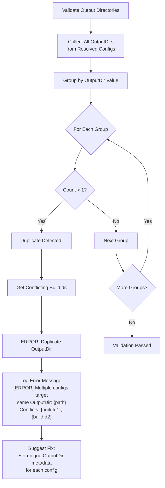

**Validation Example:**

```xml
<!-- BAD: Will fail validation -->
<ItemGroup>
  <ViteConfig Include="vite.admin.config.ts">
    <BuildId>admin</BuildId>
    <OutputDir>wwwroot/dist</OutputDir>
  </ViteConfig>
  <ViteConfig Include="vite.customer.config.ts">
    <BuildId>customer</BuildId>
    <OutputDir>wwwroot/dist</OutputDir>  <!-- CONFLICT! -->
  </ViteConfig>
</ItemGroup>

Error:
[ERROR] Multiple configurations target the same OutputDir: 'wwwroot/dist'
  Conflicting BuildIds: admin, customer

Fix:
  1. Set unique OutputDir for each config
  2. Example:
     <OutputDir>wwwroot/admin</OutputDir>
     <OutputDir>wwwroot/customer</OutputDir>

<!-- GOOD: Unique output directories -->
<ItemGroup>
  <ViteConfig Include="vite.admin.config.ts">
    <BuildId>admin</BuildId>
    <OutputDir>wwwroot/admin</OutputDir>
  </ViteConfig>
  <ViteConfig Include="vite.customer.config.ts">
    <BuildId>customer</BuildId>
    <OutputDir>wwwroot/customer</OutputDir>
  </ViteConfig>
</ItemGroup>
```

## Cache Strategy Decision Matrix

| Cache Type | Location | Invalidated By | Purpose |
|------------|----------|----------------|---------|
| Input Files Cache | `obj/Vite.InputFiles.cache` | Config/package.json change | Fast file collection |
| Build Marker | `obj/ViteKit.Msbuild.{BuildId}.marker` | Successful build | Incremental build tracking |
| Node Restore Marker | `obj/ViteKit.Msbuild.NodeRestore.marker` | Lock file change | Prevent duplicate installs |
| MSBuild Incremental | Built-in | Inputs/Outputs | Fast target skip |

## Optimization Decision Points

### Use Fast Path When:
- ✅ No source files changed
- ✅ No config files changed
- ✅ No dependencies rebuilt
- ✅ Marker files exist and are newer

### Run Full Build When:
- ❌ First build (no markers)
- ❌ After `dotnet clean`
- ❌ Lock file changed (forces npm install)
- ❌ CI/CD environment (no cached markers)

### Run Partial Build When:
- 🔄 Some configs need rebuild
- 🔄 Dependency cascade triggered
- 🔄 Specific config changed
