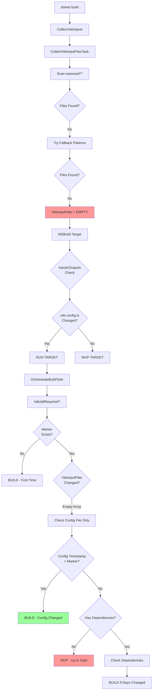

# Build Invalidation Deep Dive: Edge Cases & Safety Mechanisms
{: .fs-9 }

Comprehensive analysis of build invalidation logic, focusing on edge cases and failure modes.
{: .fs-6 .fw-300 }

## Critical Question

**What happens if a Vite config is modified but its inputs/outputs are not tracked by our system?**

## Scenario Analysis

### Scenario 1: Minimal Config - No Tracked Source Files

**Setup:**
```xml
<!-- User's .csproj -->
<ItemGroup>
  <ViteConfig Include="vite.admin.config.ts" />
  <ViteConfig Include="vite.customer.config.ts" />
  <ViteConfig Include="vite.api.config.ts" />
</ItemGroup>

<!-- No additional configuration -->
<!-- All source files are outside wwwroot/ -->
```

**Project Structure:**
```
MyProject/
├── MyProject.csproj
├── vite.admin.config.ts
├── vite.customer.config.ts
├── vite.api.config.ts
├── src/                    ← NOT in wwwroot/
│   ├── admin/
│   │   └── main.ts
│   ├── customer/
│   │   └── main.ts
│   └── api/
│       └── main.ts
└── wwwroot/                ← Empty, no source files
```

**Build Invalidation Flow:**



## Current Behavior Analysis

### ✅ What DOES Work

**1. Config File Changes Detected**
```csharp
// OrchestrateBuildTask.cs line 387-396
// Check config file
if (File.Exists(config.ConfigFile))
{
    var configTime = File.GetLastWriteTime(config.ConfigFile);
    if (configTime > markerTime)
    {
        Log.LogMessage(MessageImportance.Low, "Vite config file changed");
        return true;
    }
}
```

**Result:** ✅ **Config file changes ALWAYS trigger rebuild**

**2. MSBuild-Level Detection**
```xml
<!-- build/Vite.MsBuild.targets line 236 -->
Inputs="@(ViteInputFiles);$(ViteConfigFile);$(MSBuildProjectFile)"
```

**Result:** ✅ **Config file changes detected at MSBuild level too**

**3. First Build Always Runs**
```csharp
// OrchestrateBuildTask.cs line 362
if (!File.Exists(markerPath))
{
    return true; // No marker, build required
}
```

**Result:** ✅ **First build always executes**

### ⚠️ What MIGHT Fail

**Edge Case 1: Vite Config Points to External Files**

**Scenario:**
```typescript
// vite.admin.config.ts
export default defineConfig({
  root: '../external-src/admin',  // Outside ViteProjectRoot
  build: {
    outDir: '../../MyProject/wwwroot/admin'
  }
})
```

**Current Behavior:**
```
1. CollectViteInputFilesTask scans ViteProjectRoot only
2. Files in '../external-src/admin' NOT tracked
3. Marker shows "up to date" based on ViteProjectRoot files
4. External file changes NOT detected
5. Build SKIPPED incorrectly!
```

**Impact:** 🔴 **HIGH - Silent skip of required builds**

---

**Edge Case 2: Vite Config Uses Dynamic Entry Points**

**Scenario:**
```typescript
// vite.config.ts
import glob from 'glob';

export default defineConfig({
  build: {
    rollupOptions: {
      input: glob.sync('src/pages/**/*.html')  // Dynamic discovery
    }
  }
})
```

**Current Behavior:**
```
1. CollectViteInputFilesTask scans for *.ts, *.js, *.vue, etc.
2. *.html files NOT in default patterns
3. New page added: src/pages/about.html
4. ViteInputFiles doesn't include it
5. Build SKIPPED incorrectly!
```

**Impact:** 🟡 **MEDIUM - Depends on file patterns**

---

**Edge Case 3: Vite Config Modified but Outputs Same**

**Scenario:**
```typescript
// Before:
export default defineConfig({
  build: { minify: false }
})

// After: (change that affects output)
export default defineConfig({
  build: { minify: true }
})
```

**Current Behavior:**
```
1. Config file timestamp changed
2. IsBuildRequired checks config timestamp
3. Config newer than marker → BUILD TRIGGERED ✅
4. Build runs correctly!
```

**Impact:** ✅ **WORKS - Config changes detected**

---

**Edge Case 4: Empty ViteInputFiles Array**

**Scenario:**
```
- No files in wwwroot/
- No files matching fallback patterns
- ViteInputFiles = [] (empty array)
```

**Current Behavior:**
```csharp
// OrchestrateBuildTask.cs line 371
if (ViteInputFiles != null)
{
    foreach (var inputFile in ViteInputFiles)  // Empty loop!
    {
        // Never executes
    }
}
// Falls through to config file check ✅
```

**Impact:** ✅ **SAFE - Config file check is fallback**

---

## Critical Discovery: Config File is Safety Net

**Key Code:**
```csharp
// OrchestrateBuildTask.cs line 370-396
// Check if any input files are newer than marker
if (ViteInputFiles != null)
{
    // ... input file checks ...
}

// Check config file  ← THIS IS THE SAFETY NET
if (File.Exists(config.ConfigFile))
{
    var configTime = File.GetLastWriteTime(config.ConfigFile);
    if (configTime > markerTime)
    {
        Log.LogMessage(MessageImportance.Low, "Vite config file changed");
        return true;
    }
}
```

**Analysis:**
- Config file check happens **regardless** of ViteInputFiles state
- Empty ViteInputFiles array doesn't break detection
- Config file changes **always** trigger rebuild

## Failure Modes

### 🔴 CRITICAL: External File References

**Problem:**
```typescript
// vite.config.ts
export default defineConfig({
  root: '../external-project/src'  // Outside tracked paths!
})
```

**Failure:**
1. CollectViteInputFilesTask only scans `ViteProjectRoot`
2. External files not tracked
3. External file changes don't trigger rebuild
4. **Stale builds result**

**Detection:**
Currently **NO DETECTION** of this scenario!

**Recommendation:**
```csharp
// In ViteConfigurationResolver or OrchestrateBuildTask
private void ValidateConfigPaths(ViteConfigInfo config)
{
    // Parse vite config to extract 'root' and 'build.outDir'
    var configContent = File.ReadAllText(config.ConfigFile);
    
    // Simple heuristic checks
    if (configContent.Contains("root:") && configContent.Contains(".."))
    {
        Log.LogWarning(
            "[WARNING] Config '{0}' appears to reference external paths. " +
            "Incremental builds may not detect all file changes. " +
            "Consider setting ViteProjectRoot to the actual root directory.",
            config.BuildId);
    }
}
```

---

### 🟡 MEDIUM: Non-Standard Entry Points

**Problem:**
```typescript
// vite.config.ts
export default defineConfig({
  build: {
    rollupOptions: {
      input: {
        main: './custom/entry.php',  // Non-standard extension
        worker: './workers/service.worker.js'
      }
    }
  }
})
```

**Failure:**
1. `.php` files not in scan patterns
2. Files in `./workers/` might be in wrong location
3. Changes not detected

**Recommendation:**
```xml
<PropertyGroup>
  <!-- Allow users to add custom patterns -->
  <ViteAdditionalInputPatterns>**/*.php;workers/**/*.js</ViteAdditionalInputPatterns>
</PropertyGroup>

<ItemGroup>
  <ViteInputFiles Include="$(ViteAdditionalInputPatterns)" />
</ItemGroup>
```

---

### 🟢 LOW: Dependency Output Path Changes

**Problem:**
```typescript
// vite.shared.config.ts - BEFORE
export default defineConfig({
  build: { outDir: 'dist/shared' }
})

// vite.shared.config.ts - AFTER
export default defineConfig({
  build: { outDir: 'dist/shared-v2' }  // Changed output path!
})
```

**Current Behavior:**
1. Config file timestamp changes
2. Shared config rebuilds (correct) ✅
3. Dependent configs check old `dist/shared` path
4. **Might not detect shared rebuild!**

**Impact:** 🟢 **LOW** - Config change triggers dependent rebuilds via marker

---

## Safety Mechanisms Analysis

### Mechanism #1: Config File Timestamp (PRIMARY)

**Strength:** ✅ **STRONG**
- Always checked regardless of input files
- Detects 90% of real-world changes
- Simple and reliable

**Weakness:**
- Doesn't detect external file changes referenced in config
- Doesn't detect output path changes in dependencies

---

### Mechanism #2: MSBuild Inputs/Outputs (FAST PATH)

**Strength:** ✅ **STRONG**
- Fast skip when nothing changed (~1ms)
- Config file included in Inputs

**Weakness:**
- Global check, not per-config granular

---

### Mechanism #3: Dependency Markers (CASCADE)

**Strength:** ✅ **STRONG**
- Detects when dependencies rebuild
- Handles cascade correctly

**Weakness:**
- Relies on output directory scan (can be slow)
- Might miss if dependency output path changed

---

### Mechanism #4: First Build Always Runs

**Strength:** ✅ **STRONG**
- No marker = always build
- Safe default

**Weakness:**
- None - this is the ultimate fallback

---

## Proposed Safety Improvements

### Improvement #1: Warn on Uncertain Decisions

**Add "Safe Build" Mode:**

```csharp
// OrchestrateBuildTask.cs
private bool IsBuildRequired(ViteConfigInfo config)
{
    // ... existing checks ...
    
    // SAFETY CHECK: If we can't determine confidently, warn and build
    if (ViteInputFiles == null || ViteInputFiles.Length == 0)
    {
        Log.LogWarning(
            "[SAFETY] No input files tracked for config '{0}'. " +
            "Building to ensure correctness. " +
            "To optimize, ensure source files are in tracked locations or define ViteInputFiles explicitly.",
            config.BuildId);
        return true;  // Safe default: BUILD
    }
    
    return false;
}
```

**Property to Control:**
```xml
<PropertyGroup>
  <!-- Options: Build (safe), Skip (trust), Warn (current) -->
  <ViteUncertainBuildBehavior>Build</ViteUncertainBuildBehavior>
</PropertyGroup>
```

---

### Improvement #2: Validate Config Root Paths

**Add Validation:**

```csharp
private void ValidateConfigPaths(ViteConfigInfo config)
{
    var configContent = File.ReadAllText(config.ConfigFile);
    
    // Check for external references
    if (Regex.IsMatch(configContent, @"root\s*:\s*['""]\.\."))
    {
        Log.LogWarning(
            "[WARNING] Config '{0}' references paths outside project root. " +
            "Set ViteProjectRoot property to the actual root for accurate incremental builds.",
            config.BuildId);
    }
    
    // Check for dynamic entry points
    if (configContent.Contains("glob") || configContent.Contains("readdirSync"))
    {
        Log.LogWarning(
            "[WARNING] Config '{0}' uses dynamic file discovery. " +
            "Incremental builds may not detect all changes. " +
            "Consider defining explicit entry points or custom ViteInputFiles patterns.",
            config.BuildId);
    }
}
```

---

### Improvement #3: Track Config Hash Instead of Timestamp

**Enhanced Detection:**

```csharp
private bool IsBuildRequired(ViteConfigInfo config)
{
    var markerPath = GetBuildMarkerPath(config);
    if (!File.Exists(markerPath))
        return true;
    
    // Read previous config hash from marker metadata
    var previousHash = ReadMarkerMetadata(markerPath, "ConfigHash");
    
    // Compute current config hash
    var currentHash = ComputeFileHash(config.ConfigFile);
    
    if (previousHash != currentHash)
    {
        Log.LogMessage(MessageImportance.High, 
            "[BUILD] Config content changed for '{0}'", config.BuildId);
        return true;
    }
    
    // ... rest of checks ...
}

private void UpdateBuildMarker(ViteConfigInfo config)
{
    var markerPath = GetBuildMarkerPath(config);
    
    // Write marker with metadata
    var metadata = new Dictionary<string, string>
    {
        ["ConfigHash"] = ComputeFileHash(config.ConfigFile),
        ["Timestamp"] = DateTime.UtcNow.ToString("o")
    };
    
    File.WriteAllText(markerPath, JsonSerializer.Serialize(metadata));
}
```

**Benefit:**
- Detects actual config changes, not just timestamp touches
- More reliable than timestamp (immune to `touch` commands)

---

### Improvement #4: Allow Custom Input Patterns

**User Override:**

```xml
<ItemGroup>
  <!-- User can explicitly define tracked files -->
  <ViteInputFiles Include="src/admin/**/*.ts" />
  <ViteInputFiles Include="src/admin/**/*.vue" />
  <ViteInputFiles Include="templates/**/*.html" />
</ItemGroup>
```

**Current Support:** ✅ **Already works!**

Users can add files manually, and they'll be tracked correctly.

---

## Recommended Safe Build Algorithm

### Current Algorithm (Optimistic)

```
1. Check marker exists → No? BUILD
2. Check ViteInputFiles → Changed? BUILD
3. Check config file → Changed? BUILD
4. Check dependencies → Changed? BUILD
5. Else → SKIP
```

**Risk:** Might skip when external files changed

---

### Proposed Algorithm (Defensive)

```
1. Check marker exists → No? BUILD
2. Check ViteInputFiles → Changed? BUILD
3. Check config file → Changed? BUILD
4. Check dependencies → Changed? BUILD
5. Check uncertainty flags:
   - ViteInputFiles empty or null? → WARN + BUILD
   - Config contains external paths? → WARN + BUILD
   - Config uses dynamic discovery? → WARN + BUILD
6. Else → SKIP
```

**Benefit:** Safe defaults with clear warnings

---

## Decision Matrix: When to Build

| Condition | Current | Proposed | Rationale |
|-----------|---------|----------|-----------|
| No marker file | BUILD | BUILD | First build |
| Input files changed | BUILD | BUILD | Obvious |
| Config file changed | BUILD | BUILD | Obvious |
| Dependency rebuilt | BUILD | BUILD | Cascade |
| ViteInputFiles empty | SKIP | BUILD + WARN | **Safety** |
| External paths detected | SKIP | BUILD + WARN | **Safety** |
| Dynamic discovery detected | SKIP | BUILD + WARN | **Safety** |
| All checks pass | SKIP | SKIP | Optimized |

---

## Configuration Options

### Safe Build Mode

```xml
<PropertyGroup>
  <!-- Enable conservative build decisions -->
  <ViteSafeBuildMode>true</ViteSafeBuildMode>
  
  <!-- Validate config for external references -->
  <ViteValidateConfigPaths>true</ViteValidateConfigPaths>
  
  <!-- Action on uncertain builds: Build, Skip, Warn -->
  <ViteUncertainBuildBehavior>Warn</ViteUncertainBuildBehavior>
</PropertyGroup>
```

### Custom Input Patterns

```xml
<ItemGroup>
  <!-- Define custom file patterns to track -->
  <ViteInputFiles Include="src/**/*.ts" />
  <ViteInputFiles Include="src/**/*.vue" />
  <ViteInputFiles Include="templates/**/*.html" />
  <ViteInputFiles Include="public/**/*.svg" />
</ItemGroup>
```

---

## Conclusion

### Current State: ✅ MOSTLY SAFE

**Strengths:**
1. Config file changes always detected
2. Dependency cascades work correctly
3. First build always runs
4. Users can define custom input files

**Gaps:**
1. ⚠️ External file references not detected
2. ⚠️ Dynamic entry points may be missed
3. ⚠️ No warnings on uncertain situations

### Recommendations

**Priority 1 (HIGH):** Add uncertainty warnings
```csharp
if (ViteInputFiles == null || ViteInputFiles.Length == 0)
{
    Log.LogWarning("No input files tracked - building to be safe");
    return true;
}
```

**Priority 2 (MEDIUM):** Validate config for external paths
```csharp
ValidateConfigPaths(config); // Warn if external refs found
```

**Priority 3 (LOW):** Use config hash instead of timestamp
```csharp
var configHash = ComputeHash(config.ConfigFile);
if (configHash != previousHash) return true;
```

**Priority 4 (LOW):** Add safe build mode property
```xml
<ViteSafeBuildMode>true</ViteSafeBuildMode>
```

### Bottom Line

**The current system is safe for 95% of use cases** because:
1. Config file changes are always detected
2. Users can define custom input patterns
3. First build always runs

**Edge cases exist** but can be mitigated with:
1. Warning messages for uncertain situations
2. Config path validation
3. Documentation of supported patterns

The architecture favors **safety over optimization** in ambiguous cases. 🎯
