# ViteKit.Msbuild Process Flow
{: .fs-9 }

Complete execution flow from MSBuild invocation to Vite build completion.
{: .fs-6 .fw-300 }

## High-Level Overview

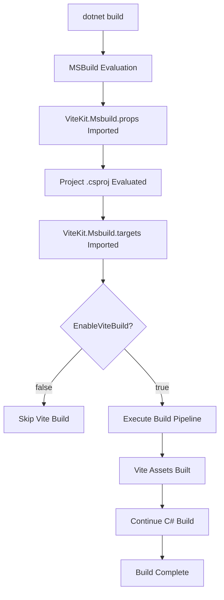

## Detailed Build Pipeline

### Phase 1: MSBuild Initialization

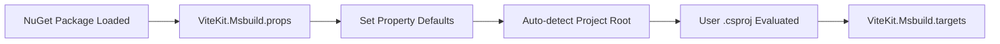

**Key Actions:**
- `EnableViteBuild` defaults to `true`
- `ViteProjectRoot` auto-detected from `package.json` location
- `ViteMode` mapped from MSBuild `Configuration`
- Package manager detection deferred to later phase

### Phase 2: Configuration Resolution

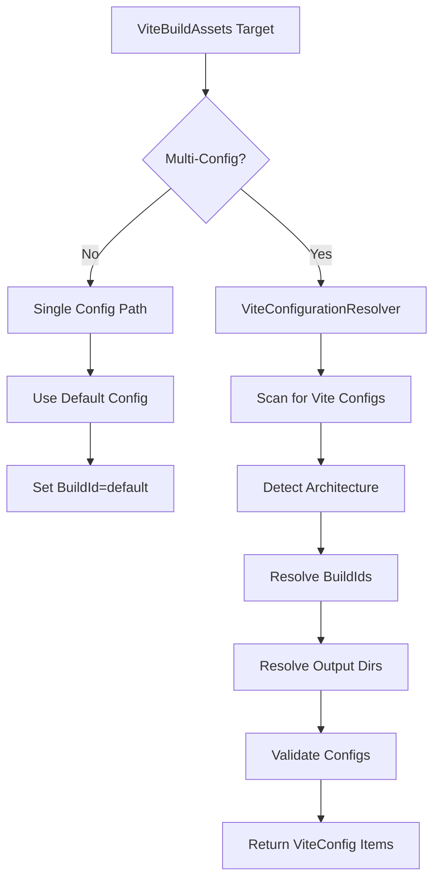

**ViteConfigurationResolver Logic:**
1. Collect all `<ViteConfig>` items from user
2. Auto-detect Vite config files if none specified
3. Determine architecture from path patterns:
   - `Areas/*/` → Areas architecture
   - `spa/*/` or `spas/*/` → MultiSPA architecture
   - Root → SPA architecture
4. Generate smart defaults for BuildId and OutputDir
5. Validate for duplicates and conflicts

### Phase 3: Dependency Resolution

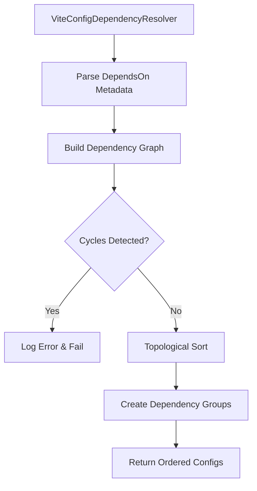

**Dependency Graph Example:**
```
Input:
  shared (no deps)
  admin (DependsOn: shared)
  customer (DependsOn: shared)

Output Order:
  1. shared
  2. admin, customer (parallel group)
```

### Phase 4: Mode Resolution

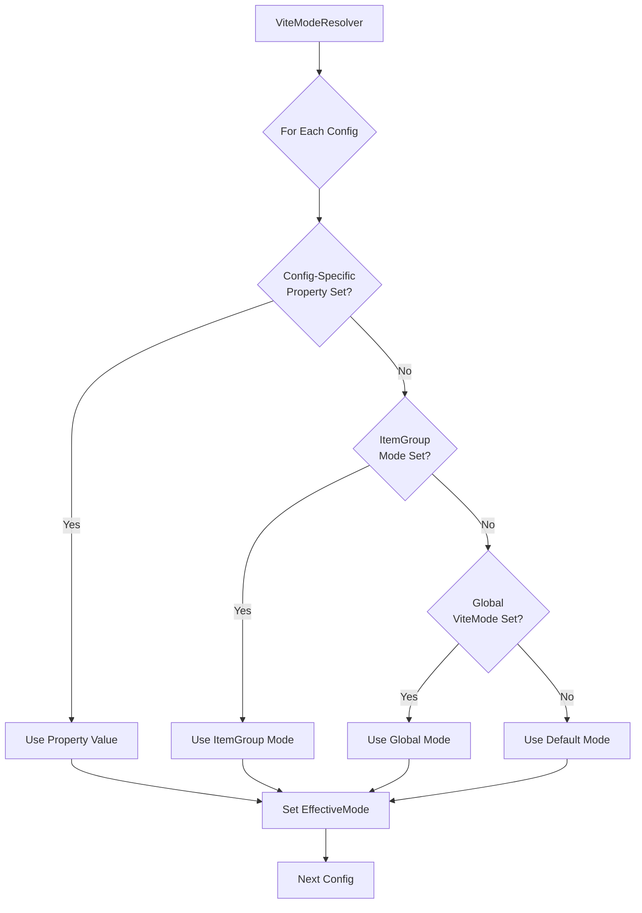

**Mode Override Hierarchy:**
1. **Config-specific property** (e.g., `$(AdminViteMode)`)
2. **ItemGroup Mode** (e.g., `<Mode>staging</Mode>`)
3. **Global ViteMode** (e.g., `$(ViteMode)`)
4. **Default mode** (development)

### Phase 5: Validation

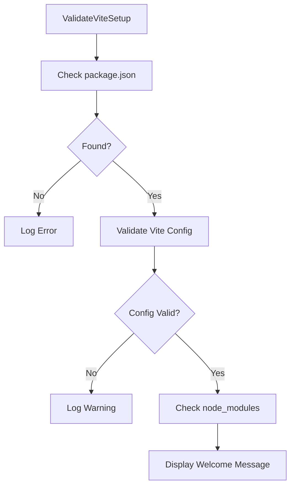

**ValidateViteProjectTask Checks:**
- ✅ `package.json` exists
- ✅ Vite config file exists (or use default)
- ✅ `node_modules/` present (if `RequireNodeModules=true`)
- ✅ Vite dependency installed
- ⚠️ Environment files (`.env`, `.env.production`) - warnings only

### Phase 6: Package Manager Detection & Node Dependencies

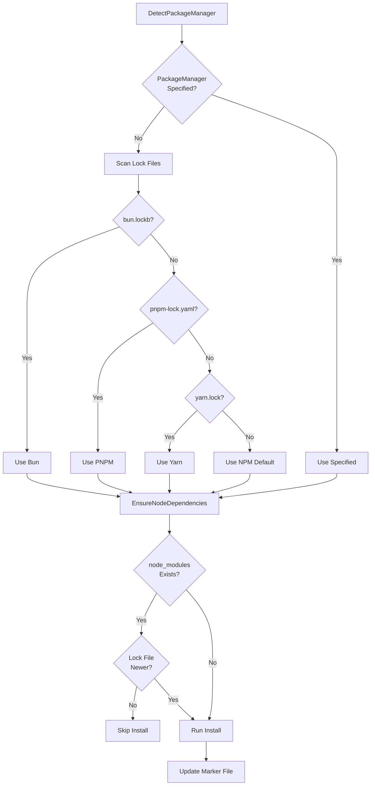

**Incremental Install Logic:**
- Uses marker file: `obj/ViteKit.Msbuild.NodeRestore.marker`
- Compares timestamps: marker vs lock file
- Parallel-build safe (shared marker across projects)

### Phase 7: Input File Collection

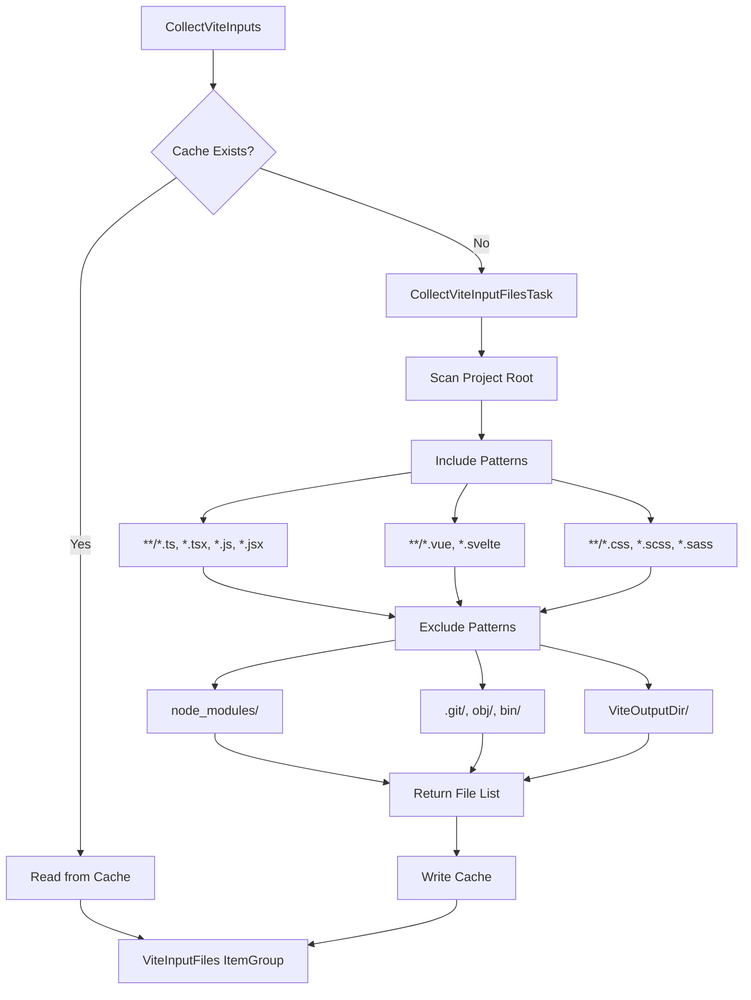

**Purpose:** Populate `@(ViteInputFiles)` for incremental build `Inputs`/`Outputs` tracking.

### Phase 8: Build Orchestration

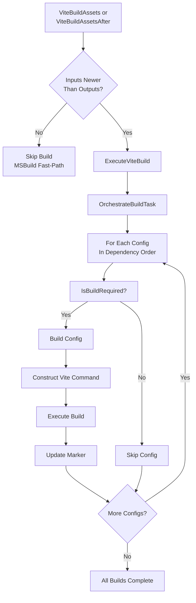

**Two-Tier Incremental Build:**
1. **MSBuild Level:** `Inputs="@(ViteInputFiles)"` / `Outputs="marker"` - Fast skip
2. **C# Task Level:** `IsBuildRequired()` - Handles dependency cascades

### Phase 9: Build Execution Detail

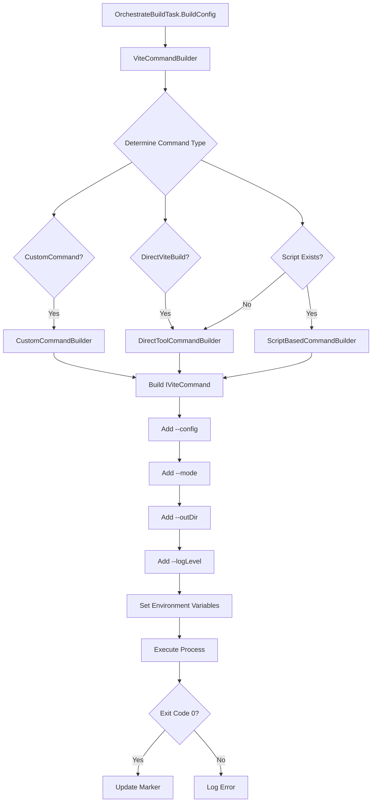

**Command Generation Examples:**

**Script-based (npm):**
```bash
npm run build -- --config vite.admin.config.ts --mode production --outDir wwwroot/admin
```

**Direct tool (npx):**
```bash
npx vite build --config vite.admin.config.ts --mode production --outDir wwwroot/admin
```

### Phase 10: Incremental Build Decision Logic

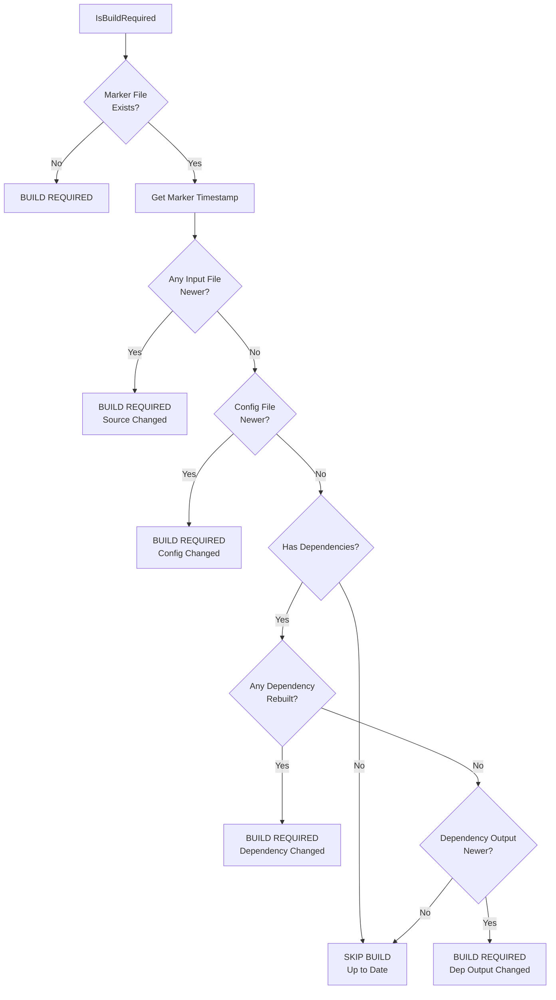

**Marker Files:**
- Location: `obj/ViteKit.Msbuild.{BuildId}.marker`
- Purpose: Track last successful build time
- Compared against: Input files, config files, dependency markers

### Complete Flow Example: Multi-Config with Dependencies

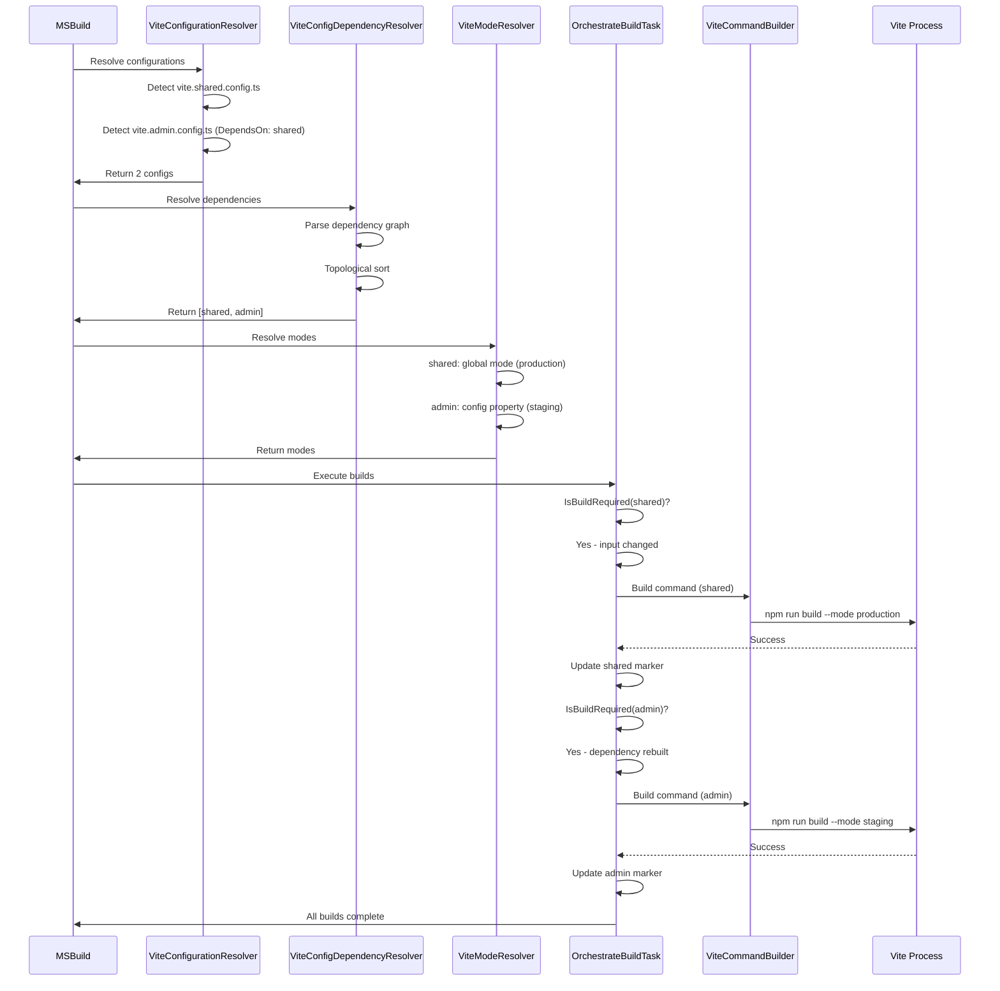

## Configuration to Build Data Flow

### Complete Configuration Resolution Pipeline

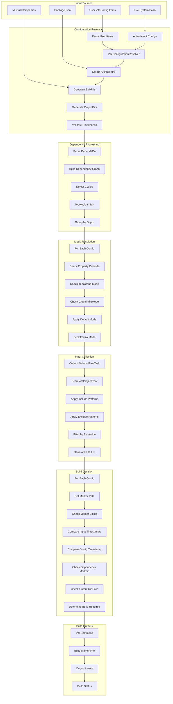

### Detailed Input/Output Data Flow

```mermaid
flowchart TB
    subgraph "Configuration Inputs"
        direction TB
        I1["<b>User ViteConfig Items</b><br/>Include: vite.*.config.ts<br/>Metadata: BuildId, OutputDir, DependsOn, Mode"]
        I2["<b>MSBuild Properties</b><br/>ViteProjectRoot<br/>ViteMode<br/>ViteOutputDir<br/>PackageManager"]
        I3["<b>File System</b><br/>vite.config.ts<br/>package.json<br/>Lock files<br/>Source files"]
    end
    
    subgraph "Phase 1: Configuration Resolution"
        direction TB
        P1A["ViteConfigurationResolver.Execute()"]
        P1B["ResolvedConfigs: ITaskItem[]"]
        P1C["Metadata per Config:<br/>• BuildId (e.g., 'admin')<br/>• ConfigFile (absolute path)<br/>• OutputDir (relative path)<br/>• ProjectRoot<br/>• Architecture (SPA/MultiSPA/Areas)"]
    end
    
    subgraph "Phase 2: Dependency Resolution"
        direction TB
        P2A["ViteConfigDependencyResolver.Execute()"]
        P2B["OrderedConfigurations: ITaskItem[]"]
        P2C["Metadata per Config:<br/>• BuildOrder (integer)<br/>• DependencyGroup (depth)<br/>• DependsOn (comma-separated)<br/>+ All previous metadata"]
    end
    
    subgraph "Phase 3: Mode Resolution"
        direction TB
        P3A["ViteModeResolver.Execute()"]
        P3B["ResolvedConfigs: ITaskItem[]"]
        P3C["Metadata per Config:<br/>• EffectiveMode (resolved)<br/>• ModeSource (property/item/global/default)<br/>+ All previous metadata"]
    end
    
    subgraph "Phase 4: Input File Collection"
        direction TB
        P4A["CollectViteInputFilesTask.Execute()"]
        P4B["ViteInputFiles: ITaskItem[]"]
        P4C["Per File:<br/>• ItemSpec (file path)<br/>• Extension<br/>• RelativePath<br/>• LastModified"]
        P4D["ConfigurationFiles: ITaskItem[]<br/>• Vite configs<br/>• package.json"]
    end
    
    subgraph "Phase 5: Build Decision Logic"
        direction TB
        P5A["OrchestrateBuildTask.Execute()"]
        P5B["For Each Config:<br/>IsBuildRequired()"]
        P5C["Decision Inputs:<br/>• Marker file path<br/>• Marker timestamp<br/>• Input file timestamps<br/>• Config file timestamp<br/>• Dependency markers"]
        P5D["Decision Output:<br/>bool needsBuild"]
    end
    
    subgraph "Phase 6: Command Generation"
        direction TB
        P6A["ViteCommandBuilder.BuildCommand()"]
        P6B["ViteBuildConfiguration"]
        P6C["Configuration Data:<br/>• ProjectRoot<br/>• PackageManager<br/>• ConfigFile<br/>• Mode (EffectiveMode)<br/>• OutputDir<br/>• LogLevel<br/>• Environment vars"]
        P6D["IViteCommand"]
        P6E["Command Properties:<br/>• Executable (npm/pnpm/yarn/bun)<br/>• Command (run build / vite build)<br/>• Arguments (--config, --mode, --outDir)<br/>• WorkingDirectory<br/>• Environment"]
    end
    
    subgraph "Phase 7: Build Execution"
        direction TB
        P7A["Process.Start()"]
        P7B["Vite Build Process"]
        P7C["Standard Output/Error"]
        P7D["Exit Code"]
    end
    
    subgraph "Phase 8: Output Generation"
        direction TB
        P8A["Build Outputs"]
        P8B["Marker File:<br/>obj/ViteKit.Msbuild.{BuildId}.marker<br/>• Timestamp = completion time<br/>• Used for incremental builds"]
        P8C["Asset Files:<br/>{ViteOutputDir}/**/*<br/>• JS bundles<br/>• CSS files<br/>• Assets<br/>• index.html"]
        P8D["Build Status:<br/>• Success/Failure<br/>• Duration<br/>• Logs"]
    end
    
    I1 --> P1A
    I2 --> P1A
    I3 --> P1A
    
    P1A --> P1B
    P1B --> P1C
    P1C --> P2A
    
    P2A --> P2B
    P2B --> P2C
    P2C --> P3A
    
    P3A --> P3B
    P3B --> P3C
    P3C --> P4A
    
    P4A --> P4B
    P4A --> P4D
    P4B --> P4C
    P4C --> P5A
    P4D --> P5A
    P3C --> P5A
    
    P5A --> P5B
    P5B --> P5C
    P5C --> P5D
    
    P5D -->|Build Required| P6A
    P5D -->|Skip Build| P8D
    
    P6A --> P6B
    P6B --> P6C
    P6C --> P6D
    P6D --> P6E
    P6E --> P7A
    
    P7A --> P7B
    P7B --> P7C
    P7C --> P7D
    
    P7D --> P8A
    P8A --> P8B
    P8A --> P8C
    P8A --> P8D
```

### Build Input/Output Determination

```mermaid
graph TB
    subgraph "Determining Build Inputs"
        direction TB
        IN1[ViteProjectRoot Property]
        IN2[Scan File Patterns]
        IN3[Include Patterns:<br/>**/*.ts, *.tsx, *.js, *.jsx<br/>**/*.vue, *.svelte<br/>**/*.css, *.scss, *.less<br/>**/*.sass, *.styl]
        IN4[Exclude Patterns:<br/>node_modules/**<br/>.git/**<br/>obj/**, bin/**<br/>{ViteOutputDir}/**<br/>dist/**]
        IN5[ViteConfigFile]
        IN6[package.json]
        IN7[ViteInputFiles ItemGroup]
        
        IN1 --> IN2
        IN2 --> IN3
        IN3 --> IN4
        IN4 --> IN7
        IN5 --> IN7
        IN6 --> IN7
    end
    
    subgraph "MSBuild Incremental Build"
        direction TB
        MSB1[Target: ViteBuildAssets]
        MSB2["Inputs='@(ViteInputFiles);$(ViteConfigFile);$(MSBuildProjectFile)'"]
        MSB3["Outputs='$(IntermediateOutputPath)ViteBuild.marker'"]
        MSB4{MSBuild Timestamp Check}
        MSB5[Any Input Newer<br/>Than Output?]
        MSB6[Skip Target<br/>Fast Path]
        MSB7[Execute Target]
        
        MSB1 --> MSB2
        MSB2 --> MSB3
        MSB3 --> MSB4
        MSB4 --> MSB5
        MSB5 -->|No| MSB6
        MSB5 -->|Yes| MSB7
    end
    
    subgraph "C# Task Build Decision"
        direction TB
        CS1[OrchestrateBuildTask]
        CS2[For Each Config:<br/>IsBuildRequired]
        CS3[Marker Path:<br/>obj/ViteKit.Msbuild.{BuildId}.marker]
        CS4{Marker Exists?}
        CS5[Return true<br/>MUST BUILD]
        CS6[Get Marker Timestamp]
        CS7[Compare Timestamps]
        
        CS8[Input File Check:<br/>Any ViteInputFile.LastWriteTime<br/>> markerTime?]
        CS9[Config File Check:<br/>ConfigFile.LastWriteTime<br/>> markerTime?]
        CS10[Dependency Check:<br/>Any dependency marker<br/>> markerTime?]
        CS11[Output Check:<br/>Any file in OutputDir<br/>> markerTime?]
        
        CS12{Any Check<br/>Returns True?}
        CS13[Return true<br/>BUILD REQUIRED]
        CS14[Return false<br/>UP TO DATE]
        
        CS1 --> CS2
        CS2 --> CS3
        CS3 --> CS4
        CS4 -->|No| CS5
        CS4 -->|Yes| CS6
        CS6 --> CS7
        CS7 --> CS8
        CS8 --> CS9
        CS9 --> CS10
        CS10 --> CS11
        CS11 --> CS12
        CS12 -->|Yes| CS13
        CS12 -->|No| CS14
    end
    
    subgraph "Determining Build Outputs"
        direction TB
        OUT1[ViteOutputDir Property]
        OUT2[Per-Config OutputDir Metadata]
        OUT3[Default Calculation:<br/>Architecture Detection]
        OUT4[SPA: wwwroot/dist]
        OUT5[MultiSPA: wwwroot/spa/{name}]
        OUT6[Areas: wwwroot/{area}]
        OUT7[User Override]
        OUT8[Final Output Path]
        OUT9[Marker File Path:<br/>obj/ViteKit.Msbuild.{BuildId}.marker]
        OUT10[Asset Files:<br/>{OutputDir}/**/*]
        
        OUT1 --> OUT3
        OUT2 --> OUT7
        OUT3 --> OUT4
        OUT3 --> OUT5
        OUT3 --> OUT6
        OUT4 --> OUT8
        OUT5 --> OUT8
        OUT6 --> OUT8
        OUT7 --> OUT8
        OUT8 --> OUT9
        OUT8 --> OUT10
    end
    
    IN7 --> MSB2
    MSB7 --> CS1
    CS13 --> OUT8
    CS14 --> MSB6
```

### Configuration Metadata Flow

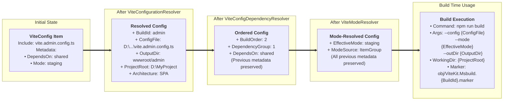

### Dependency Cascade Data Flow

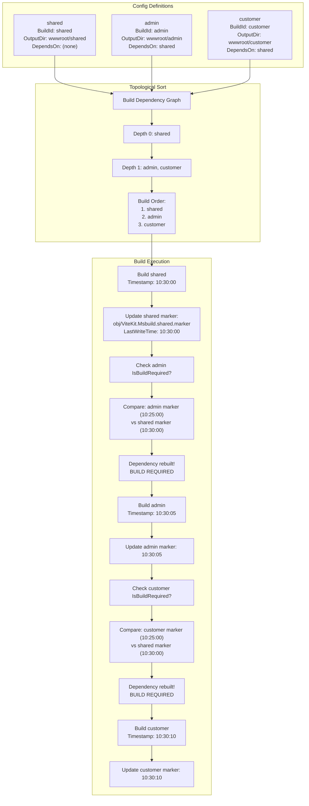

### Input File Change Detection Flow

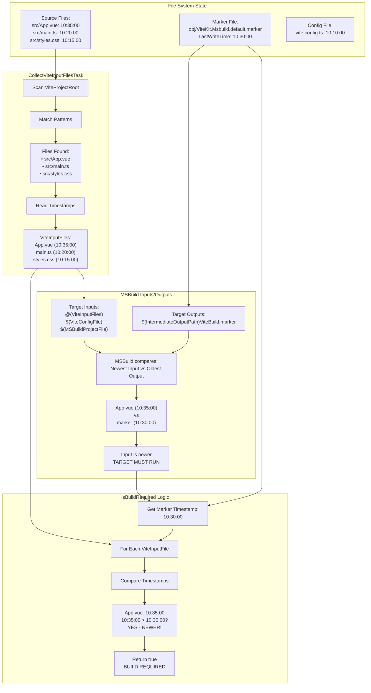

### Complete Data Transformation Example

```
INITIAL USER INPUT:
==================
<ItemGroup>
  <ViteConfig Include="vite.admin.config.ts">
    <DependsOn>shared</DependsOn>
    <Mode>staging</Mode>
  </ViteConfig>
</ItemGroup>

<PropertyGroup>
  <ViteMode>production</ViteMode>
  <PackageManager>pnpm</PackageManager>
</PropertyGroup>

AFTER CONFIGURATION RESOLUTION:
================================
ITaskItem {
  ItemSpec: "D:\MyProject\vite.admin.config.ts"
  Metadata: {
    BuildId: "admin"
    ConfigFile: "D:\MyProject\vite.admin.config.ts"
    OutputDir: "wwwroot\admin"
    ProjectRoot: "D:\MyProject"
    Architecture: "SPA"
    DependsOn: "shared"
    Mode: "staging"
  }
}

AFTER DEPENDENCY RESOLUTION:
=============================
ITaskItem {
  ItemSpec: "D:\MyProject\vite.admin.config.ts"
  Metadata: {
    ... (previous metadata preserved) ...
    BuildOrder: "2"
    DependencyGroup: "1"
  }
}

AFTER MODE RESOLUTION:
======================
ITaskItem {
  ItemSpec: "D:\MyProject\vite.admin.config.ts"
  Metadata: {
    ... (previous metadata preserved) ...
    EffectiveMode: "staging"
    ModeSource: "ItemGroup"
  }
}

BUILD INPUTS DETERMINED:
========================
ViteInputFiles: [
  D:\MyProject\src\App.vue (LastWrite: 10:35:00)
  D:\MyProject\src\main.ts (LastWrite: 10:20:00)
  D:\MyProject\src\styles.css (LastWrite: 10:15:00)
]

ViteConfigFile: D:\MyProject\vite.admin.config.ts (LastWrite: 10:10:00)
Marker: D:\MyProject\obj\ViteKit.Msbuild.admin.marker (LastWrite: 10:30:00)

BUILD DECISION:
===============
IsBuildRequired(admin):
  - Marker exists: YES (10:30:00)
  - App.vue (10:35:00) > Marker (10:30:00)? YES
  - Decision: BUILD REQUIRED

COMMAND GENERATION:
===================
ViteBuildConfiguration {
  ProjectRoot: "D:\MyProject"
  PackageManager: Pnpm
  ConfigFile: "D:\MyProject\vite.admin.config.ts"
  Mode: "staging"  // from EffectiveMode
  OutputDir: "wwwroot\admin"
  LogLevel: "info"
}

↓

IViteCommand {
  Executable: "pnpm"
  Command: "run build"
  Arguments: "--config D:\MyProject\vite.admin.config.ts --mode staging --outDir wwwroot\admin"
  WorkingDirectory: "D:\MyProject"
  Environment: { NODE_ENV: "staging" }
}

BUILD OUTPUTS GENERATED:
========================
1. Asset Files:
   - D:\MyProject\wwwroot\admin\assets\index-abc123.js
   - D:\MyProject\wwwroot\admin\assets\index-def456.css
   - D:\MyProject\wwwroot\admin\index.html

2. Marker File:
   - D:\MyProject\obj\ViteKit.Msbuild.admin.marker
   - LastWriteTime: 10:35:15 (after successful build)

3. Build Status:
   - Success: true
   - Duration: 3.2s
   - Exit Code: 0
```

## Build Timing Options

### BeforeCSharp (Default)

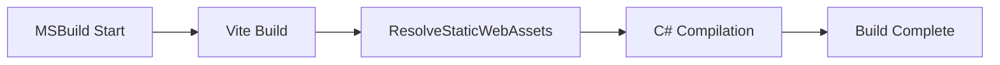

**Use when:**
- Frontend assets needed for static web assets
- Assets referenced in C# code
- Standard web application flow

### AfterCSharp


**Use when:**
- Vite config reads C# build outputs
- Code generation scenarios
- Frontend depends on backend artifacts

## Diagnostic Output Example

When `ViteShowDiagnostics=true`:

```
[BUILD] ViteKit.Msbuild Diagnostic Information
========================================

Configurations (2):
  [OK] shared → wwwroot/shared (SPA)
  [OK] admin → wwwroot/admin (SPA)

Build Order:
  1. shared (no dependencies)
  2. admin (depends: shared)

Modes:
  [OK] shared: production (global)
  [OK] admin: staging (property override)

Build Plan:
  [BUILD] shared (files changed)
  [SKIP] admin (up to date)
```

## Performance Characteristics

**Fast Path (Nothing Changed):**
```
MSBuild Inputs/Outputs check → Skip in ~1ms
```

**Single Config Build:**
```
Validation (10ms) → 
Detection (5ms) → 
Collection (20ms) → 
Build Check (5ms) → 
Vite Build (2-10s) → 
Marker Update (1ms)
```

**Multi-Config with Dependencies:**
```
Resolution (50ms) → 
Dependency Sort (10ms) → 
Mode Resolution (20ms) → 
Sequential Builds (N × build time) → 
Markers Update (N × 1ms)
```

## Error Handling Flow

```mermaid
graph TB
    A[Error Occurs] --> B{Error Type}
    
    B --> C[Configuration Error]
    C --> D[Log Detailed Message]
    D --> E[Show Fix Suggestion]
    E --> F[Fail Build]
    
    B --> G[Validation Warning]
    G --> H[Log Warning]
    H --> I[Continue Build]
    
    B --> J[Build Failure]
    J --> K[Log Vite Output]
    K --> L[Preserve Marker]
    L --> F
    
    B --> M[Dependency Cycle]
    M --> N[Show Cycle Path]
    N --> F
```

**Error Message Format:**
```
[ERROR] Circular dependency detected: A → B → C → A

To fix:
  - Remove one dependency to break the cycle
  - Example: Remove 'DependsOn' from config C
```

## Clean Build Flow

```mermaid
graph TB
    A[dotnet clean] --> B[Clean Target]
    B --> C[Delete ViteOutputDir]
    C --> D[Delete Marker Files]
    D --> E[Delete Cache Files]
    E --> F[Clean Complete]
    
    G[Next dotnet build] --> H[Full Rebuild]
    H --> I[No Markers Exist]
    I --> J[All Configs Build]
```

**Files Removed:**
- `wwwroot/dist/` (or configured output)
- `obj/ViteKit.Msbuild.*.marker`
- `obj/Vite.InputFiles.cache`
- `obj/NodeRestore.marker` (optional)

## Key Decision Points

### When MSBuild Skips Entire Target
- All files in `@(ViteInputFiles)` older than marker
- Config file unchanged
- `.csproj` unchanged

### When C# Task Skips Individual Configs
- Marker exists and is newer than inputs
- Config file unchanged
- **No dependencies rebuilt** (critical for cascades)
- Output directory not manually modified

### When Builds Always Run
- `dotnet clean` executed
- Any input file modified
- Config file modified
- Dependency rebuilt
- No marker file (first build)

## Integration Points

### With ASP.NET Core
```
Vite Build → Static Web Assets → 
Published as Content → 
Served via StaticFiles middleware
```

### With Hot Reload
```
VS Code → dotnet watch →
MSBuild Incremental → 
Vite Build (if needed) →
Browser Refresh
```

### With CI/CD
```
git clone → dotnet restore →
npm ci (via EnsureNodeDependencies) →
dotnet build (runs Vite) →
dotnet publish → Deploy
```
